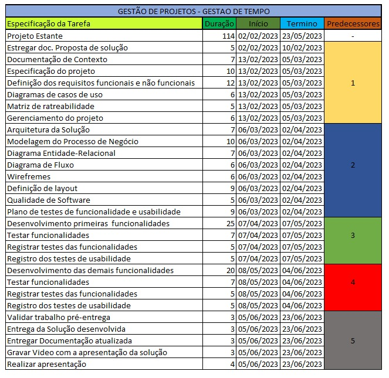

# Especificações do Projeto

## Personas

Pedro, 22 anos, é um estudante do ensino médio que precisa gerenciar seus estudos e suas atividades extracurriculares. Ele precisa de um aplicativo que possa ajudá-lo a manter-se organizado e produtivo, e que possa ser acessado facilmente em seu celular. Prioriza a simplicidade e a facilidade de uso.

Marcos, 40 anos, é um professor universitário que precisa gerenciar suas atividades acadêmicas e administrativas. Ele precisa de um aplicativo que possa ajudá-lo a lembrar-se de suas atividades e prazos importantes, e que possa ser acessado facilmente em seu computador ou tablet. Prioriza a flexibilidade e a integração com outras ferramentas.

Maria, 28 anos, é uma estudante universitária que precisa gerenciar seus estudos e atividades extracurriculares. Ela está sempre em movimento, por isso precisa de um aplicativo que possa ser acessado facilmente em seu telefone celular. Prioriza a praticidade e a flexibilidade.

Ana, 30 anos, é uma mãe de duas crianças que trabalha meio período e precisa equilibrar suas tarefas pessoais e profissionais. Ela precisa de um aplicativo que a ajude a gerenciar suas tarefas de forma eficiente e a lembrar-se de eventos importantes para seus filhos e família. Prioriza a praticidade e a flexibilidade.

João, 35 anos, é um profissional autônomo que trabalha em casa e precisa gerenciar suas tarefas diárias. Ele precisa de um aplicativo que o ajude a se lembrar das atividades e projetos em que está trabalhando. Prioriza a organização e a facilidade de uso.

Carlos, 45 anos, é um executivo que precisa gerenciar seu trabalho e sua vida pessoal. Ele precisa de um aplicativo que possa integrar suas tarefas de trabalho e pessoais, e que permita a organização de acordo com a prioridade. Prioriza a eficiência e a produtividade.

Luísa, 25 anos, é uma empresária que precisa gerenciar sua agenda diária e organizar suas tarefas para aumentar sua produtividade. Ela precisa de um aplicativo que possa integrar suas tarefas pessoais e profissionais, e que permita a visualização da agenda e das tarefas de forma clara. Prioriza a eficiência e a praticidade.

Júlia, 22 anos, é uma estagiária que precisa gerenciar suas tarefas diárias e acompanhar as tarefas atribuídas pelos colegas de equipe. Ela precisa de um aplicativo que possa ajudá-la a organizar suas tarefas e colaborar com sua equipe. Prioriza a simplicidade e a integração com outras ferramentas de comunicação.

Caio, 50 anos, é um empreendedor que precisa gerenciar suas tarefas de negócios e acompanhar suas finanças. Ele precisa de um aplicativo que possa ajudá-lo a gerenciar suas tarefas e despesas, e que possa ser acessado facilmente em seu celular ou computador. Prioriza a eficiência e a simplicidade.

Isabela, 18 anos, é uma estudante do ensino médio que precisa gerenciar suas tarefas escolares e seus compromissos pessoais. Ela precisa de um aplicativo que possa ajudá-la a organizar suas tarefas e lembretes, e que possa ser acessado facilmente em seu celular. Prioriza a simplicidade e a praticidade.

 

## Histórias de Usuários

Com base na análise das personas foram identificadas as seguintes histórias de usuários:

| PERSONA | FUNCIONALIDADE | MOTIVO/VALOR |
| ------- | -------------- | ------------- |
| Pedro |  Como usuário, quero receber notificações sobre minhas tarefas, para que eu não as esqueça. | Receber notificações sobre as tarefas.| 

| Marcos | Como usuário, quero compartilhar minha lista de tarefas com outras pessoas, para que possamos trabalhar juntos em projetos. | Compartilhar a lista de tarefas com outras pessoas.

| Maria | Como usuário, quero marcar uma tarefa como concluída, para que eu possa acompanhar meu progresso. | Marcar tarefas como concluídas. |

| Ana | Como usuário, quero definir uma data e hora para uma tarefa, para que eu possa me lembrar de realizá-la no momento certo. | Definir datas e horários para as tarefas. |

| João| Como usuário, quero excluir uma tarefa da minha lista, para que eu possa remover tarefas que não são mais relevantes. | Excluir uma tarefa que não é mais relevante.

| Carlos | Como usuário, quero adicionar uma nova tarefa à minha lista, para que eu possa lembrar de algo que preciso fazer. | Adicionar novas tarefas à lista.

| Luísa| Como usuário, quero organizar minhas tarefas por ordem de prioridade, para que eu possa focar nas mais importantes primeiro. | Organizar as tarefas por prioridade.

| Júlia | Como usuário, quero ter a opção de adicionar notas ou comentários em minhas tarefas, para que eu possa adicionar informações importantes. | Adicionar notas ou comentários em tarefas.

| Caio | Como usuário, quero poder agrupar minhas tarefas em categorias, para que eu possa visualizá-las de maneira organizada e clara. | Agrupar tarefas em categorias.

| Isabela | Como usuário, quero poder definir tarefas recorrentes, para que eu possa lembrar de realizar atividades que se repetem em um determinado período. | Definir tarefas recorrentes.| 

## Requisitos

As tabelas que se seguem apresentam os requisitos funcionais e não funcionais que detalham o escopo do projeto.

### Requisitos Funcionais

| ID     | Descrição do Requisito | Prioridade |
| ------ | ---------------------- | ---------- |
| RF01	| O usuário deve receber notificações sobre suas tarefas | 	Alta |
| RF02	| O usuário deve poder compartilhar sua lista de tarefas com outras pessoas	| Média|
| RF03	| O usuário deve poder excluir uma tarefa da sua lista  	| Alta |
| RF04	| O usuário deve poder definir uma data e hora para uma tarefa	| Alta |
| RF05	| O usuário deve poder adicionar uma nova tarefa à sua lista |	Alta |
| RF06	| O usuário deve poder marcar uma tarefa como concluída |	Alta |
| RF07 |	O usuário deve poder organizar suas tarefas por ordem de prioridade |	Média |
| RF08	| O usuário deve poder adicionar notas ou comentários em suas tarefas |	Baixa |
| RF09	| O usuário deve poder agrupar suas tarefas em categorias |	Baixa |
| RF10	| O usuário deve poder definir tarefas recorrentes |	Baixa |

### Requisitos não Funcionais

| ID      | Descrição do Requisito                                                            | Prioridade |
| ------- | --------------------------------------------------------------------------------- | ---------- |
| RNF-001 |  Segurança: O sistema deve garantir a segurança das informações dos usuários, impedindo o acesso não autorizado e garantindo a privacidade dos dados. 
| Alta |
| RNF-002 | Usabilidade: A interface do sistema deve ser intuitiva e fácil de usar, de forma a garantir uma experiência agradável para os usuários. | Alta |
| RNF-003 | Escalabilidade: O sistema deve ser capaz de suportar um grande número de usuários simultâneos sem perda de performance.  | Média |
| RNF-004 | Confiabilidade: O sistema deve ser confiável e estar disponível para os usuários sempre que necessário, minimizando as chances de interrupções ou falhas.  | Alta |
| RNF-005 | Portabilidade: O sistema deve ser desenvolvido com tecnologias e ferramentas que permitam sua utilização em diferentes plataformas e dispositivos, como celulares e tablets.  | Média |
| RNF-006 | Integração: O sistema deve ter a capacidade de se integrar com outras ferramentas de produtividade e colaboração, como o Google Drive e o Slack. | Alta |
| RNF-007 |  Personalização: O sistema deve permitir que os usuários personalizem a interface de acordo com suas preferências e necessidades, podendo alterar cores, fontes e layout. | Baixa |

## Restrições

As questões que limitam a execução desse projeto e que se configuram como obrigações claras para o desenvolvimento do projeto em questão são apresentadas na tabela a seguir.

| ID      | Restrição                                                                                             |
| ------- | ----------------------------------------------------------------------------------------------------- |
| RNF-001 | O prazo para o desenvolvimento da aplicação é até o final do primeiro semestre de 2023                |
| ALTA    |
| RNF-002 | A aplicação móvel deve ser desenvolvida utilizando os conhecimentos dos microfundamentos da faculdade |
| ALTA    |
| RNF-003 | O orçamento disponível para o projeto é 210 reais                                                     | MÉDIA |

# DIAGRAMA DE CASOS DE USO

## Gerenciamento de Projeto
Utilizando o PMBoK padrão todo o projeto será gerenciado utilizando planilhas integradas que possibilitarão a visualização da evolução dos trabalhos, bem como a possibilidade de melhoria prática a cada implementação. Para tal, todas as informações referentes ao cronograma, previsão de custos, recursos e equipe envolvidas, atividades ocupadas, reuniões, produção de documentos, entre outros, serão devidamente registradas com o objetivo de construir base documental sólida a fim de que o desenvolvimento do projeto transcorra obedecendo padrões e normas de excelência e qualidade.

## Matriz de Rastreabilidade
A matriz de rastreabilidade é uma ferramenta utilizada para facilitar a visualização do relacionamento entre requisitos e outros preservados ou objetos, permitindo a rastreabilidade entre os requisitos e os objetivos de negócio.

A matriz deve contemplar todos os elementos relevantes que fazem parte do sistema, conforme a figura meramente ilustrativa apresentada a seguir.

# GERENCIAMENTO DE TEMPO

## Gerenciamento de Equipe
A equipe cumprirá suas tarefas de acordo com as habilidades e características subjetivas de cada membro, a fim de que cada um contribua e produza o melhor trabalho a ser incorporado ao projeto e consequentemente ao produto final. O gerenciamento das tarefas será registrado para que a produtividade e a qualidade sejam mantidas durante todo o desenvolvimento do projeto.

| Tarefa                         | Responsável | Status       |
| ------------------------------ | ----------- | ------------ |
| Definição de tema              | Arthur      | Concluído    |
| Documentação de contexto       | Ana Carolina | Concluído    |
| Personas/Histórias de usuários | Guilherme    | Concluído    |
| Casos de uso                   | Khaio       | Concluído    |
| Requisitos funcionais          | Arthur       | Conluído     |
| Requisitos não funcionais      | Ana Carolina  | Conluído     |
| Restrições                     | Guilherme    | Concluído    |
| Diagrama de casos de uso       | Khaio     | Pendente     |
| Projeto de gestão              | Arthur      | Pendente     |
| Matriz de rastreabilidade      | Arthur      | Pendente     |
| GitHub                         | Todos       | Em andamento |
| Revisão do projeto             | Todos       | Pendente     |
| Entrega do projeto             | Todos       | Pendente     |

## Gestão de Orçamento
Com base em todo o escopo produzido anteriormente, os custos do projeto serão gerenciados abaixo na tabela abaixo:

| Recursos necessários | Custo (R$) |
| -------------------- | ---------- |
| Hospedagem           | R$ 100,00  |
| Domínio              | R$ 39,90   |
| Serviços             | R$ 71,10   |
| Total                | R$ 210,00  |
