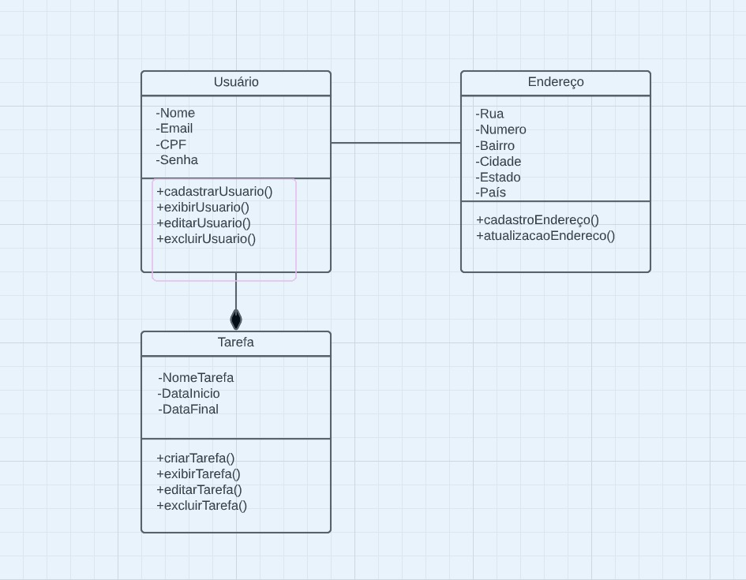

# Arquitetura da Solução

O projeto será realizado em React Native para o Front End e utilizará o conceito de REST API para atender a parte do Back End, será hospedado em cloud através do serviço Google Cloud.


## Diagrama de Classes



## Modelo ER

Segue abaixo o digrama de EER feito no Workbench, tendo em vista que nosso banco de dados será feito com a tecnologia MySql.


## Esquema Relacional

Falta criar o texto e a apresentação do esquema:

```
O Esquema Relacional corresponde à representação dos dados em tabelas juntamente com as restrições de integridade e chave primária.
 
As referências abaixo irão auxiliá-lo na geração do artefato “Esquema Relacional”.

> - [Criando um modelo relacional - Documentação da IBM](https://www.ibm.com/docs/pt-br/cognos-analytics/10.2.2?topic=designer-creating-relational-model)
```

## Modelo Físico

Disponibilizamos o arquivo SQL do banco de dados atualizado, clique no link abaixo:

 [Acesse o aquivo SQL](../banco/banco.sql)

## Tecnologias Utilizadas

Para implementar a solução utilizamos:

- Github
- Figma
- Node
- Typescript
- MySql
- React Native
- Visual Studio Code

## Qualidade de Software

Falta texto

```
Conceituar qualidade de fato é uma tarefa complexa, mas ela pode ser vista como um método gerencial que através de procedimentos disseminados por toda a organização, busca garantir um produto final que satisfaça às expectativas dos stakeholders.

No contexto de desenvolvimento de software, qualidade pode ser entendida como um conjunto de características a serem satisfeitas, de modo que o produto de software atenda às necessidades de seus usuários. Entretanto, tal nível de satisfação nem sempre é alcançado de forma espontânea, devendo ser continuamente construído. Assim, a qualidade do produto depende fortemente do seu respectivo processo de desenvolvimento.

A norma internacional ISO/IEC 25010, que é uma atualização da ISO/IEC 9126, define oito características e 30 subcaracterísticas de qualidade para produtos de software.
Com base nessas características e nas respectivas sub-características, identifique as sub-características que sua equipe utilizará como base para nortear o desenvolvimento do projeto de software considerando-se alguns aspectos simples de qualidade. Justifique as subcaracterísticas escolhidas pelo time e elenque as métricas que permitirão a equipe avaliar os objetos de interesse.
```
